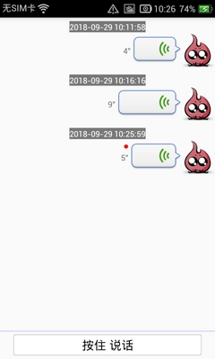
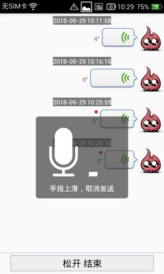
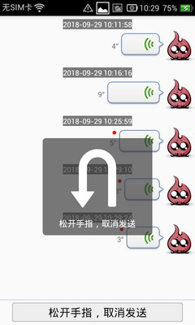
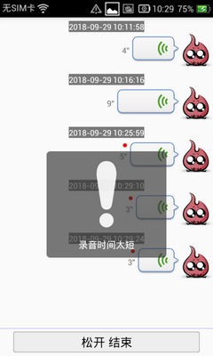
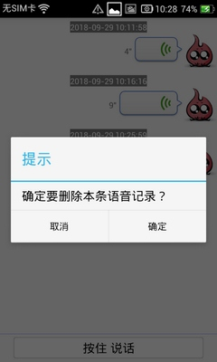

# AndroidWeChatAudioRecorderDemo

## 项目介绍
这是一个仿微信的语音聊天录入功能的demo 
参照了hyman大神的视频教程，url:https://www.imooc.com/video/7442 
此demo在教程的基础上修复一些bug，并增加了语音记录的保存、读取和删除功能，对语音记录是否已读增加了“红点”标记 

### 效果图如下

  
 
 